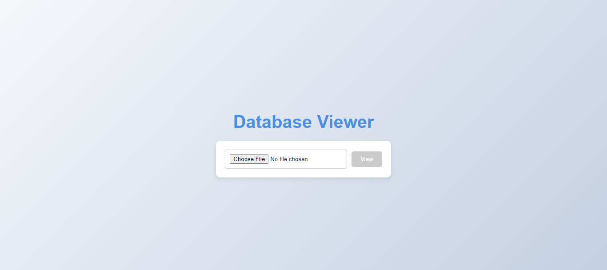
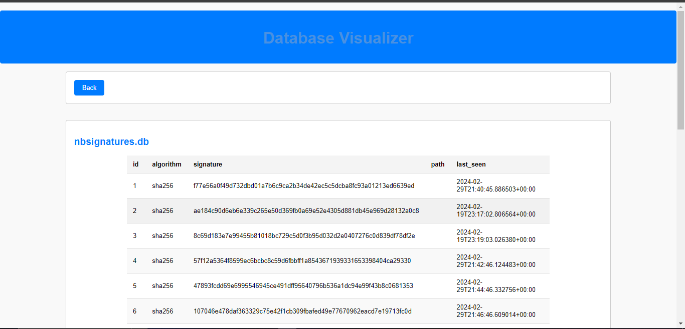
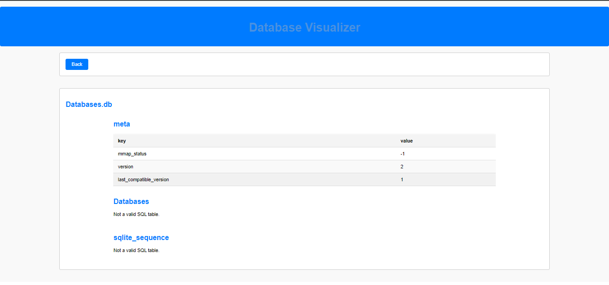

# Database Visualizer

Welcome to the Database Visualizer app! This React application allows you to visualize SQL databases with an easy-to-use interface.

## Features

- Connect and visualize SQL databases.
- View tables and their contents.
- Simple and intuitive UI.

## Installation

1. Clone the repository:
    ```bash
    git clone https://github.com/yourusername/database-visualizer.git
    ```

2. Navigate into the project directory:
    ```bash
    cd database-visualizer
    ```

3. Install the dependencies:
    ```bash
    npm install
    ```

4. Start the development server:
    ```bash
    npm start
    ```

## Usage

1. Open your browser and navigate to `http://localhost:3000`.
2. Follow the instructions on the screen to connect to your SQL database and visualize its contents.

## Screenshots

Here are some screenshots of the application:

### Dashboard


### Table View


### Settings


## License

This project is licensed under the MIT License - see the [LICENSE](./LICENSE) file for details.

## Contact

For any questions or feedback, please reach out to [nisaacdz@gmail.com](mailto:nisaacdz@gmail.com).
